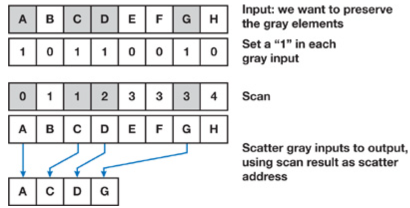
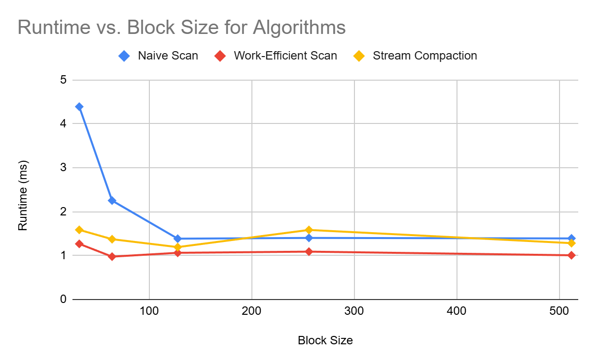
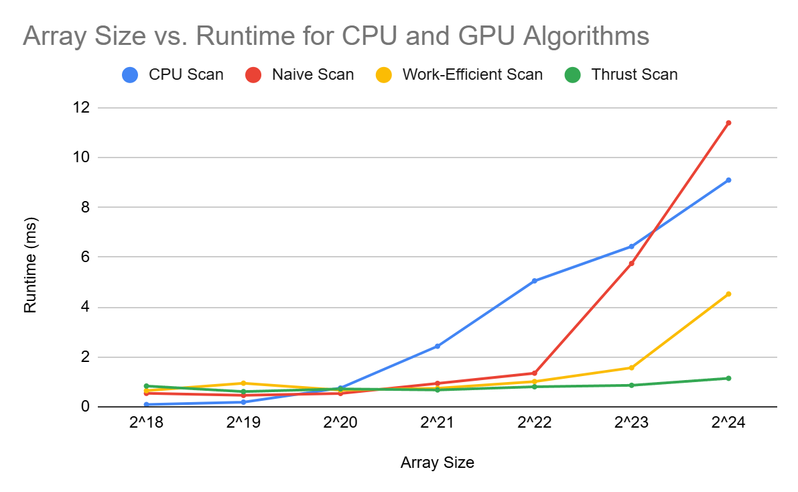
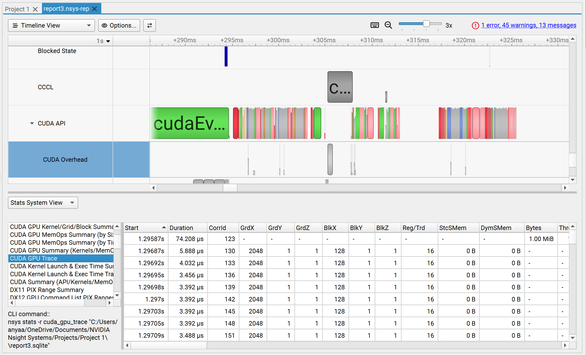
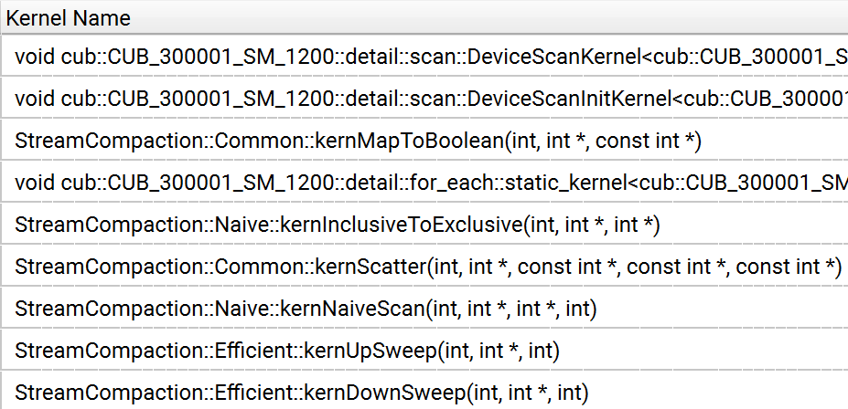
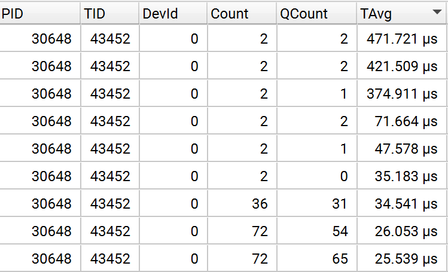
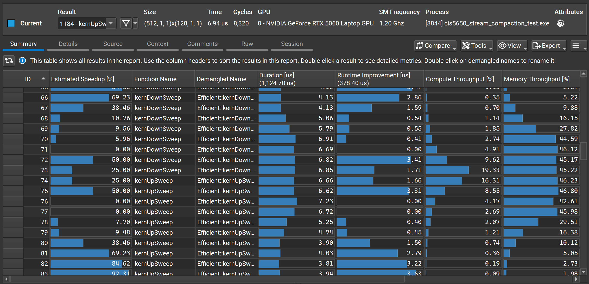
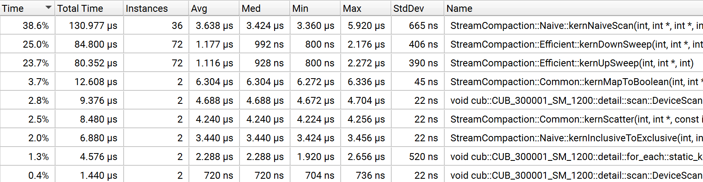

CUDA Stream Compaction
======================

**University of Pennsylvania, CIS 565: GPU Programming and Architecture, Project 2**

* Anya Agarwal
  * [LinkedIn](https://www.linkedin.com/in/anya-agarwal/)
* Tested on: Windows 11, AMD Ryzen 7 260 @ 380GHz 16GB, RTX 5060

# Stream Compaction

<p align="center">
  
  <p align="center">
  The stream compaction process. Image taken from <a href="{{https://developer.nvidia.com/gpugems/gpugems3/part-vi-gpu-computing/chapter-39-parallel-prefix-sum-scan-cuda}}">GPU Gems 3, Section 39.3.1. Figure 39-10</a>
  </p>
</p>


## Overview

The goal of this project was to implement stream compaction on the GPU using CUDA, and to analyze its performance. Stream compaction allows us to create an array with elements that meet a certain criteria, given an input array. The process of stream compaction involves a scan, so it is necessary to write code pertaining to the scan in order to efficiently complete the stream compaction. The scan involves calculating the exclusive prefix sum of an array. The GPU algorithms are implemented from [GPU Gems 3, Chapter 39](https://developer.nvidia.com/gpugems/gpugems3/part-vi-gpu-computing/chapter-39-parallel-prefix-sum-scan-cuda).

### CPU Scan and Stream Compaction

The first step was to write the scan and stream compaction code to run on the CPU. Since it's on the CPU, this code was implemented to run on a single thread, with for loops to go through each element of the array.

### GPU Naive Scan

The naive scan running on the GPU involves using a parallel reduction to sum all the values of the array with a tree structure. For each level of the tree, we sum up corresponding values in the array and store them for use in future levels of the tree. Since this work doesn't interfere, we are able to run this process in parallel. This results in an algorithm that runs `n` threads in parallel, `log2(n)` number of times. Therefore, the total work done by this naive algorithm is `O(n*log2(n))`. 

### GPU Work-Efficient Scan

To optimize stream compaction, we edit the naive scan to be more work-efficient. Instead of having threads do overlapping work, we use a balanced binary tree to cut out extra work at each level. The algorithm involves an up-sweep (reduce) phase to accumulate partial sums and a down-sweep phase to complete the scan. Both phases still run `log2(n)` times, but only `2^d` threads do work, where `d` is the level. The total work is around `O(n)`, which is considerably better.

### GPU Stream Compaction

With a more efficient scan, we can write our stream compaction algorithm. The first step computes a boolean array for whether to include each element. Next, we perform a scan on the boolean array to produce indices for the final array. Finally, we use the boolean array to decide which values to keep and the index array to place them correctly. What makes this algorithm very efficient to run on the GPU is the fact that all three of these steps are each able to run in parallel.

### GPU Thrust Scan

This implementation simply uses the Thrust library scan function to perform the scan of an array. We can use this to compare the performance of the Thrust implementation of scan with the performance of the scan versions described above.


## Performance Analysis

To test and analyze performance, I used CUDA event timers and recorded the time after each process. I excluded memory operations for the timing to analyze strictly the logic of each of the implementations.

### Block Size

 

| Block Size | Naive Scan | Work-Efficient Scan | Stream Compaction |
| ---------- | ---------- | ------------------- | ----------------- |
| 32         | 4.392      | 1.267               | 1.586             |
| 64         | 2.253      | 0.976               | 1.373             |
| 128        | 1.385      | 1.063               | 1.193             |
| 256        | 1.403      | 1.09                | 1.584             |
| 512        | 1.392      | 1.007               | 1.283             |

The graph above was made using an array size of 2^22. Based on the graph, it seems that the most optimal block size for the naive scan and stream compaction would be 128, while the most optimal block size for the work-efficient scan would be 64. It's interesting to note that the stream compaction algorithm uses the work-efficient scan, so its performance based on block size would be affected by the scan algorithm as well.

### Array Size

 

| Array Size | CPU Scan | Naive Scan | Work-Efficient Scan | Thrust Scan |
| ---------- | -------- | ---------- | ------------------- | ----------- |
| 2^18       | 0.09     | 0.539      | 0.647               | 0.833       |
| 2^19       | 0.187    | 0.458      | 0.947               | 0.61        |
| 2^20       | 0.753    | 0.535      | 0.668               | 0.717       |
| 2^21       | 2.429    | 0.938      | 0.743               | 0.676       |
| 2^22       | 5.052    | 1.349      | 1.014               | 0.804       |
| 2^23       | 6.431    | 5.749      | 1.566               | 0.862       |
| 2^24       | 9.094    | 11.389     | 4.525               | 1.142       |

The graph above was made using a block size of 128. We can see that runtimes for all implementations of scan seem to stay in the same ballpark until an array size of 2^20, where they start to diverge. The CPU scan has more of a linear increase in runtime, which makes sense since it's a single thread program with singular for loops. The naive scan grows more exponentially, even surpassing the CPU scan, since the work at each level grows dramatically with the increase in array size. As expected, the work-efficient scan seems to scale a lot better, since we were able to optimize the amount of work being done for the computation. The thrust scan is the most optimal of all, with the runtime barely increasing as array size grows.


## Further Performance Analysis



Depicted is a screenshot from NVIDIA Nsight Systems, which shows a timeline of the CUDA API calls throughout the program and how long they took to run. Using the visual timeline as well as the table with the values, we can make conclusions about speedups and slowdowns in each of the implementations.

### Thrust

  

This image is also from Nsight Systems, and shows how much time on average that the kernels take to run. The first two kernel calls are from the Thrust scan implementation. From the time average, we can see that DeviceScanKernel and DeviceScanInitKernel are the highest from the kernel calls done by Thrust, excluding memory calls. Looking into the trace of the kernel calls, it seems that there is one more kernel call, named static_kernel. These three kernels are called multiple times, which could point to the fact that the implementation is highly parallelized. Zooming into the visual timeline, it seems that these kernel calls are also dispersed between some memory calls. The actual time taken to scan looks very minimal compared to the memory calls of the implementation. This decreased scan timing along with the way it's dispersed could be reason for why the Thrust scan algorithm is so much faster.

### Naive and Work-Efficient

 
 

The first image is taken from Nsight Compute, which provides more detailed information on the timings of the implementations, and how that may affect properties like throughput. The second image is from Nsight Systems and shows the CUDA GPU Kernel Summary, including runtimes for the different kernel calls. First, we can see just how slow the naive scan is, as it takes up 38.6% of the total runtime. The bottleneck most likely just comes from the way that the data is computed. All threads are doing work, but it is redundant work. The work-efficient scan is a little more interesting, especially looking at the image from Nsight Compute. We can see clear fluctuations in runtime, compute throughput, and memory throughput, that seem to match up with each other. The more kernUpSweep calls there are, the worse it gets, and the more kernDownSweep calls there are, the better it gets. This can be explained by the fact that as we progress further into the tree, fewer threads are becoming active. So the runtime is better than the naive scan due to less work being done, but the overall performance isn't great since at several points of the algorithm, there are times where several threads are idle. 

### Extra Credit: Optimizing Work-Efficient Scan

In the work-efficient scan, we originally launch every thread during up-sweep and down-sweep for each level of the tree. However, since we only need a specific amount of those threads to actually run and do work, we just return early from the kernel if the thread isn't one that we need. This would slow down the overall runtime of the scan, as we are doing unnecessary overhead with launching threads that we don't need. Instead, we can limit the number of threads we actually launch to only be the amount we need, by editing the size of the grid before running the kernel. Then, within the kernel, an appropriate stride can be applied to the thread index to get the correct thread value that we need. The tests and performance analysis throughout this report utilizes this extra optimization of the work-efficient scan.


## Output of Test Program

The output is created with an array size of 2^22 and a block size of 128.

```
****************
** SCAN TESTS **
****************
    [  12   0  44  38  21  12  45  17  41  33  10   3  38 ...  49   0 ]
==== cpu scan, power-of-two ====
   elapsed time: 1.6729ms    (std::chrono Measured)
    [   0  12  12  56  94 115 127 172 189 230 263 273 276 ... 102750257 102750306 ]
==== cpu scan, non-power-of-two ====
   elapsed time: 1.5562ms    (std::chrono Measured)
    [   0  12  12  56  94 115 127 172 189 230 263 273 276 ... 102750153 102750199 ]
    passed
==== naive scan, power-of-two ====
   elapsed time: 1.43587ms    (CUDA Measured)
    passed
==== naive scan, non-power-of-two ====
   elapsed time: 1.16451ms    (CUDA Measured)
    passed
==== work-efficient scan, power-of-two ====
   elapsed time: 0.977088ms    (CUDA Measured)
    passed
==== work-efficient scan, non-power-of-two ====
   elapsed time: 0.823296ms    (CUDA Measured)
    passed
==== thrust scan, power-of-two ====
   elapsed time: 0.592512ms    (CUDA Measured)
    passed
==== thrust scan, non-power-of-two ====
   elapsed time: 0.588064ms    (CUDA Measured)
    passed

*****************************
** STREAM COMPACTION TESTS **
*****************************
    [   2   0   0   2   1   2   1   3   3   3   2   3   0 ...   3   0 ]
==== cpu compact without scan, power-of-two ====
   elapsed time: 5.9067ms    (std::chrono Measured)
    [   2   2   1   2   1   3   3   3   2   3   2   3   3 ...   1   3 ]
    passed
==== cpu compact without scan, non-power-of-two ====
   elapsed time: 6.2641ms    (std::chrono Measured)
    [   2   2   1   2   1   3   3   3   2   3   2   3   3 ...   2   3 ]
    passed
==== cpu compact with scan ====
   elapsed time: 18.6087ms    (std::chrono Measured)
    [   2   2   1   2   1   3   3   3   2   3   2   3   3 ...   1   3 ]
    passed
==== work-efficient compact, power-of-two ====
   elapsed time: 1.31165ms    (CUDA Measured)
    passed
==== work-efficient compact, non-power-of-two ====
   elapsed time: 1.04259ms    (CUDA Measured)
    passed
